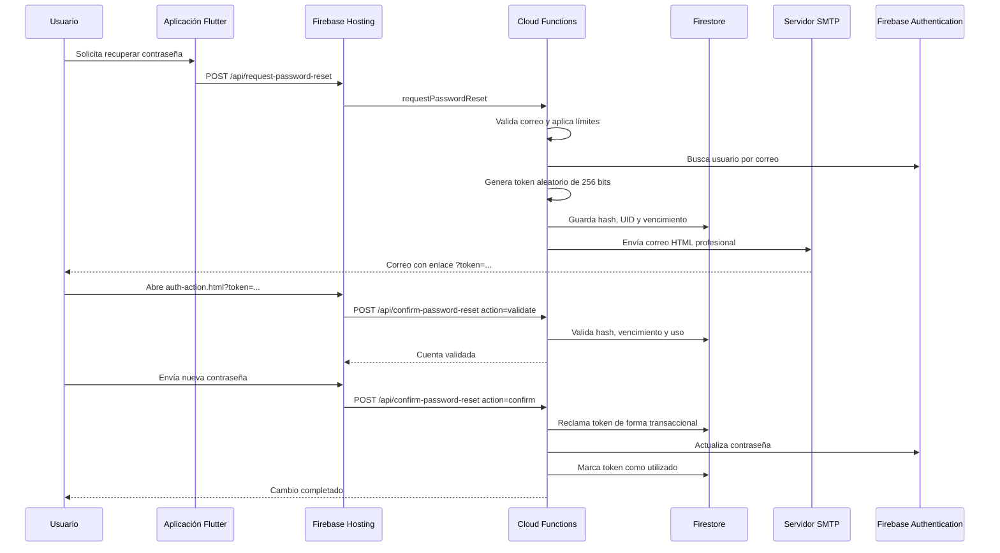

# Manual de implementación: recuperación de contraseña profesional

## 1. Objetivo

Este manual explica cómo implementar en Firebase y Flutter un sistema propio de
recuperación de contraseña que:

- envía correos HTML con diseño profesional;
- abre una página de cambio de contraseña personalizada;
- no utiliza la pantalla genérica `__/auth/action` de Firebase;
- genera tokens criptográficos de un solo uso;
- almacena únicamente el hash de cada token;
- vence los enlaces automáticamente;
- limita intentos por correo e IP;
- no revela si una cuenta existe;
- protege las credenciales SMTP mediante Google Cloud Secret Manager.

La implementación descrita corresponde al sistema desplegado para:

`https://sistema-integrado-sindicato.web.app`

Para usarla en otro proyecto deben reemplazarse el identificador de Firebase,
dominio público, nombre de la organización, colores y credenciales SMTP.

---

## 2. Problema que resuelve

Firebase Authentication incluye un flujo predeterminado de recuperación de
contraseña. Ese flujo funciona, pero su pantalla y correo tienen opciones de
personalización limitadas.

En este proyecto, Firebase rechazaba modificar la plantilla o URL global de
acción con:

```text
EMAIL_TEMPLATE_UPDATE_NOT_ALLOWED
```

La solución fue implementar un backend propio:

1. Flutter solicita la recuperación al backend.
2. El backend verifica internamente si la cuenta existe.
3. Genera un token aleatorio seguro.
4. Guarda solamente el hash del token en Firestore.
5. Envía un correo HTML mediante SMTP.
6. El usuario abre una página profesional.
7. La página valida el token con el backend.
8. El backend actualiza la contraseña usando Firebase Admin SDK.
9. El token queda marcado como utilizado.

---

## 3. Arquitectura final



---

## 4. Componentes utilizados

### Servicios de Firebase y Google Cloud

- Firebase Authentication
- Cloud Firestore
- Firebase Hosting
- Cloud Functions for Firebase, segunda generación
- Google Cloud Secret Manager
- Artifact Registry

### Tecnologías

- Flutter
- Node.js 22
- Firebase Admin SDK
- Firebase Functions v2
- Nodemailer
- Gmail SMTP o proveedor SMTP equivalente

### Archivos principales de esta implementación

```text
functions/
  index.js
  email-template.js
  email-template.test.js
  package.json
  package-lock.json

web/
  auth-action.html

lib/services/
  auth_service.dart

lib/providers/
  auth_provider.dart

tool/
  setup_password_reset_secrets.ps1

firebase.json
pubspec.yaml
```

---

## 5. Requisitos previos

Antes de implementar el sistema en otro proyecto:

1. Crear o seleccionar un proyecto de Firebase.
2. Habilitar Firebase Authentication con correo y contraseña.
3. Habilitar Cloud Firestore.
4. Configurar Firebase Hosting.
5. Instalar Node.js y Firebase CLI.
6. Iniciar sesión con Firebase CLI.
7. Vincular el repositorio al proyecto.
8. Tener un plan de Firebase compatible con Cloud Functions.
9. Tener una cuenta o proveedor SMTP.

Comandos básicos:

```powershell
npm install -g firebase-tools
firebase login
firebase use --add
firebase projects:list
```

Verificar herramientas:

```powershell
firebase --version
node --version
flutter --version
```

---

## 6. Preparar Gmail SMTP

### 6.1 Requisito obligatorio

No se debe utilizar la contraseña normal de Gmail.

Gmail exige una **contraseña de aplicación** para conexiones SMTP desde el
backend.

### 6.2 Crear una contraseña de aplicación

1. Abrir la cuenta de Google que enviará los correos.
2. Entrar en **Seguridad**.
3. Activar **Verificación en 2 pasos**.
4. Abrir **Contraseñas de aplicaciones**.
5. Crear una contraseña para la aplicación.
6. Guardarla directamente en Secret Manager.

La contraseña de aplicación suele contener 16 caracteres. Google puede
mostrarla separada por espacios; el backend elimina los espacios antes de
autenticarse.

### 6.3 Datos SMTP de Gmail

```text
Host: smtp.gmail.com
Puerto: 465
Seguridad: SSL/TLS
Usuario: correo Gmail completo
Contraseña: contraseña de aplicación
```

### 6.4 Errores comunes de Gmail

```text
535-5.7.8 Username and Password not accepted
```

El correo y la contraseña no coinciden, la contraseña es incorrecta o pertenece
a otra cuenta.

```text
534-5.7.9 Application-specific password required
```

Se utilizó la contraseña normal de Gmail. Debe generarse una contraseña de
aplicación.

---

## 7. Crear el backend de Functions

### 7.1 Estructura

Crear la carpeta:

```text
functions/
```

### 7.2 Dependencias

Ejemplo de `functions/package.json`:

```json
{
  "name": "password-reset-functions",
  "private": true,
  "main": "index.js",
  "engines": {
    "node": "22"
  },
  "scripts": {
    "check": "node --check index.js && node --test",
    "test": "node --test"
  },
  "dependencies": {
    "firebase-admin": "^13.5.0",
    "firebase-functions": "^7.0.0",
    "nodemailer": "^8.0.10"
  }
}
```

Instalar:

```powershell
cd functions
npm install
cd ..
```

### 7.3 Responsabilidades de `requestPasswordReset`

Esta función debe:

1. aceptar únicamente solicitudes `POST`;
2. normalizar y validar el correo;
3. limitar intentos por correo e IP;
4. buscar el usuario mediante Firebase Admin;
5. generar un token aleatorio;
6. guardar solo el hash del token;
7. crear el correo profesional;
8. enviar mediante SMTP;
9. devolver un mensaje genérico.

Constantes principales:

```javascript
const RATE_LIMIT_COLLECTION = "_systemRateLimits";
const RESET_TOKEN_COLLECTION = "_passwordResetTokens";
const EMAIL_LIMIT = {maximum: 3, windowMs: 60 * 60 * 1000};
const IP_LIMIT = {maximum: 20, windowMs: 60 * 60 * 1000};
const RESET_TOKEN_LIFETIME_MS = 30 * 60 * 1000;
```

Generación segura:

```javascript
function createResetToken() {
  return crypto.randomBytes(32).toString("base64url");
}

function hash(value) {
  return crypto.createHash("sha256").update(value).digest("hex");
}
```

El token real se envía al usuario. Firestore recibe únicamente:

```text
SHA-256(token)
```

### 7.4 Documento de token

Ejemplo conceptual de un documento en `_passwordResetTokens`:

```json
{
  "uid": "UID_FIREBASE_AUTH",
  "email": "usuario@dominio.com",
  "createdAt": "SERVER_TIMESTAMP",
  "expiresAt": "TIMESTAMP_FUTURO",
  "usedAt": null
}
```

El identificador del documento es el hash SHA-256 del token.

### 7.5 Responsabilidades de `confirmPasswordReset`

La función acepta dos acciones:

```json
{
  "action": "validate",
  "token": "TOKEN_RECIBIDO"
}
```

Valida:

- formato del token;
- existencia del hash;
- vencimiento;
- que no haya sido utilizado;
- que no esté siendo procesado.

Para confirmar:

```json
{
  "action": "confirm",
  "token": "TOKEN_RECIBIDO",
  "newPassword": "NUEVA_CONTRASEÑA"
}
```

La función:

1. reclama el token dentro de una transacción;
2. actualiza la contraseña con Firebase Admin;
3. marca el token como utilizado;
4. libera el reclamo si Firebase falla.

Este mecanismo evita que dos solicitudes simultáneas utilicen el mismo enlace.

---

## 8. Crear el correo HTML profesional

El diseño vive en:

```text
functions/email-template.js
```

Debe incluir:

- nombre y marca de la organización;
- título claro;
- correo de la cuenta;
- botón principal;
- aviso de seguridad;
- enlace alternativo;
- versión de texto plano.

Siempre se deben escapar datos variables:

```javascript
function escapeHtml(value) {
  return String(value)
    .replaceAll("&", "&amp;")
    .replaceAll("<", "&lt;")
    .replaceAll(">", "&gt;")
    .replaceAll('"', "&quot;")
    .replaceAll("'", "&#039;");
}
```

Para adaptar el diseño a otro proyecto, reemplazar:

```javascript
const PUBLIC_APP_URL = "https://TU-PROYECTO.web.app";
```

También cambiar:

- nombre de la organización;
- asunto;
- colores;
- textos;
- pie del mensaje;
- logotipo, si se utiliza.

Evitar CSS complejo. Los clientes de correo funcionan mejor con tablas y estilos
en línea.

---

## 9. Configurar secretos SMTP

Nunca guardar credenciales SMTP en:

- Git;
- archivos `.env` publicados;
- Flutter;
- JavaScript del navegador;
- `firebase.json`;
- documentación;
- chats o tickets.

### 9.1 Configuración directa

```powershell
firebase functions:secrets:set SMTP_USER --project TU_PROJECT_ID
firebase functions:secrets:set SMTP_PASSWORD --project TU_PROJECT_ID
```

### 9.2 Configuración con el script seguro

En este proyecto se creó:

```powershell
./tool/setup_password_reset_secrets.ps1
```

El script:

1. solicita el correo;
2. solicita la contraseña de forma oculta;
3. crea archivos temporales sin BOM;
4. envía los valores a Secret Manager;
5. borra los archivos temporales;
6. limpia la memoria segura disponible.

Para otro proyecto:

```powershell
./tool/setup_password_reset_secrets.ps1 -ProjectId "TU_PROJECT_ID"
```

### 9.3 Rotar secretos

Cuando se genere una nueva contraseña de aplicación:

```powershell
./tool/setup_password_reset_secrets.ps1 -ProjectId "TU_PROJECT_ID"
firebase deploy --only functions:requestPasswordReset --project TU_PROJECT_ID --force
```

Después de verificar el envío, deshabilitar versiones antiguas desde Secret
Manager.

Si una contraseña se publica accidentalmente, debe revocarse inmediatamente en
Google y deshabilitarse en Secret Manager.

---

## 10. Configurar Firebase Hosting

Agregar Functions y rewrites en `firebase.json`.

Ejemplo:

```json
{
  "functions": [
    {
      "source": "functions",
      "codebase": "default",
      "predeploy": [
        "npm --prefix \"$RESOURCE_DIR\" run check"
      ]
    }
  ],
  "hosting": {
    "public": "build/web",
    "rewrites": [
      {
        "source": "/api/request-password-reset",
        "function": {
          "functionId": "requestPasswordReset",
          "region": "us-central1"
        }
      },
      {
        "source": "/api/confirm-password-reset",
        "function": {
          "functionId": "confirmPasswordReset",
          "region": "us-central1"
        }
      },
      {
        "source": "**",
        "destination": "/index.html"
      }
    ]
  }
}
```

Ventajas de usar rewrites:

- Flutter llama al mismo dominio público;
- no se expone directamente la URL regional de Functions;
- se simplifica CORS;
- se puede cambiar la región o backend sin modificar Flutter.

---

## 11. Crear la página profesional

La página vive en:

```text
web/auth-action.html
```

El correo abre:

```text
https://TU-PROYECTO.web.app/auth-action.html?token=TOKEN
```

La página debe:

1. leer `token` de la URL;
2. llamar a `POST /api/confirm-password-reset` con `action=validate`;
3. mostrar la cuenta validada;
4. pedir contraseña y confirmación;
5. validar longitud y coincidencia;
6. llamar al backend con `action=confirm`;
7. mostrar éxito o error;
8. ofrecer regreso al inicio de sesión.

Endpoint:

```javascript
const BACKEND_RESET_ENDPOINT = "/api/confirm-password-reset";
```

Validación:

```javascript
await backendResetRequest({
  action: "validate",
  token: backendToken
});
```

Confirmación:

```javascript
await backendResetRequest({
  action: "confirm",
  token: backendToken,
  newPassword: password
});
```

La página actual mantiene compatibilidad con enlaces antiguos de Firebase, pero
los correos nuevos utilizan el token propio del backend.

---

## 12. Integrar Flutter

Agregar `http`:

```powershell
flutter pub add http
```

En `AuthService`, definir el endpoint:

```dart
static const String _passwordResetEndpoint =
    'https://TU-PROYECTO.web.app/api/request-password-reset';
```

Solicitud:

```dart
final response = await http
    .post(
      Uri.parse(_passwordResetEndpoint),
      headers: const {'Content-Type': 'application/json'},
      body: jsonEncode({'email': email.trim()}),
    )
    .timeout(const Duration(seconds: 30));
```

No usar para este flujo:

```dart
FirebaseAuth.instance.sendPasswordResetEmail(...)
```

Ese método enviaría el correo y abriría el controlador predeterminado de
Firebase.

### Mensaje de privacidad

La interfaz debe mostrar siempre un mensaje genérico:

```text
Si la cuenta está registrada, recibirás un correo profesional con un enlace seguro.
```

No mostrar:

```text
El usuario no existe.
```

Esto evita enumerar cuentas registradas.

---

## 13. Seguridad de Firestore

Las colecciones internas:

```text
_passwordResetTokens
_systemRateLimits
```

deben ser accesibles únicamente mediante Firebase Admin SDK.

Las reglas de Firestore no deben permitir acceso desde clientes:

```javascript
match /_passwordResetTokens/{document=**} {
  allow read, write: if false;
}

match /_systemRateLimits/{document=**} {
  allow read, write: if false;
}
```

Firebase Admin SDK ignora las reglas de cliente y opera con la cuenta de
servicio de la función.

---

## 14. Activar eliminación automática con TTL

Los documentos de tokens y límites contienen `expiresAt`.

Configurar TTL para:

```text
_passwordResetTokens.expiresAt
_systemRateLimits.expiresAt
```

Esto elimina documentos vencidos automáticamente y evita acumulación.

Puede configurarse desde:

**Google Cloud Console > Firestore > Time-to-live**

La creación de una política TTL puede tardar varios minutos.

---

## 15. Despliegue completo

### 15.1 Verificaciones previas

```powershell
flutter pub get
dart analyze lib test
npm --prefix functions run check
```

### 15.2 Configurar secretos

```powershell
./tool/setup_password_reset_secrets.ps1 -ProjectId "TU_PROJECT_ID"
```

### 15.3 Desplegar Functions

```powershell
firebase deploy --only functions --project TU_PROJECT_ID --force
```

### 15.4 Compilar Flutter Web

```powershell
flutter build web --release --no-pub
```

### 15.5 Desplegar Hosting

```powershell
firebase deploy --only hosting --project TU_PROJECT_ID
```

### 15.6 Configurar limpieza de imágenes

Cloud Functions de segunda generación utiliza Artifact Registry.

Configurar una política para evitar acumulación:

```powershell
firebase functions:artifacts:setpolicy `
  --location us-central1 `
  --days 7 `
  --force `
  --project TU_PROJECT_ID
```

---

## 16. Pruebas obligatorias

### 16.1 Correo inexistente

Debe devolver `200` y mensaje genérico:

```powershell
$body = @{ email = "cuenta-inexistente@example.com" } | ConvertTo-Json

Invoke-RestMethod `
  -Uri "https://TU-PROYECTO.web.app/api/request-password-reset" `
  -Method Post `
  -ContentType "application/json" `
  -Body $body
```

Respuesta esperada:

```json
{
  "ok": true,
  "message": "Si la cuenta está registrada, recibirás un correo con un enlace seguro."
}
```

### 16.2 Correo real

Solicitar recuperación para una cuenta de prueba registrada.

Comprobar:

- código HTTP `200`;
- correo recibido;
- asunto y diseño correctos;
- botón abre `auth-action.html`;
- cuenta mostrada correctamente;
- nueva contraseña válida;
- inicio de sesión con contraseña nueva.

### 16.3 Token inválido

```powershell
$body = @{
  action = "validate"
  token = "invalid-token"
} | ConvertTo-Json

Invoke-RestMethod `
  -Uri "https://TU-PROYECTO.web.app/api/confirm-password-reset" `
  -Method Post `
  -ContentType "application/json" `
  -Body $body
```

Debe responder que el enlace es inválido, vencido o utilizado.

### 16.4 Token utilizado dos veces

Después de cambiar la contraseña, abrir nuevamente el enlace.

Resultado esperado:

```text
El enlace no es válido, venció o ya fue utilizado.
```

### 16.5 Límite de intentos

Solicitar varias veces para el mismo correo.

Resultado esperado al superar el límite:

```text
Has realizado varios intentos. Espera unos minutos e inténtalo nuevamente.
```

---

## 17. Revisar registros

```powershell
firebase functions:log `
  --only requestPasswordReset `
  --project TU_PROJECT_ID `
  --lines 30
```

```powershell
firebase functions:log `
  --only confirmPasswordReset `
  --project TU_PROJECT_ID `
  --lines 30
```

Los registros no deben incluir:

- contraseñas;
- tokens completos;
- secretos SMTP;
- correos completos si no son necesarios.

Esta implementación registra solo una referencia hash parcial del correo.

Mensaje de éxito esperado:

```text
Password reset email sent
```

---

## 18. Solución de errores

### `EMAIL_TEMPLATE_UPDATE_NOT_ALLOWED`

Firebase no permite modificar la plantilla o URL global.

Solución:

Utilizar el backend propio descrito en este manual.

### `Cloud Functions API ... disabled`

Cloud Functions no está habilitado.

Solución:

Ejecutar el despliegue con una cuenta con permisos suficientes o habilitar la
API desde Google Cloud Console.

### `Cloud Secret Manager has no latest version`

El secreto existe, pero no tiene una versión habilitada.

Solución:

```powershell
firebase functions:secrets:set SMTP_PASSWORD --project TU_PROJECT_ID
```

### `409 unable to queue the operation`

Existe otra actualización de la función en curso.

Solución:

Esperar aproximadamente 30 a 60 segundos y volver a desplegar.

### `535 Username and Password not accepted`

El correo SMTP y la contraseña no coinciden.

Solución:

- confirmar `SMTP_USER`;
- confirmar que la contraseña pertenece a esa cuenta;
- rotar la contraseña de aplicación.

### `534 Application-specific password required`

Se utilizó una contraseña normal de Gmail.

Solución:

Generar una contraseña de aplicación con verificación en dos pasos.

### El correo no llega

Revisar:

- carpeta de spam;
- límites del proveedor SMTP;
- logs de Functions;
- cuenta existente en Firebase Authentication;
- versión activa de secretos;
- remitente bloqueado;
- políticas de Google Workspace.

### La página muestra enlace inválido

Posibles causas:

- el token venció;
- el token ya fue utilizado;
- el enlace fue modificado;
- el documento fue eliminado por TTL;
- el usuario abrió un correo antiguo.

---

## 19. Adaptar a otro proveedor SMTP

Para usar otro proveedor, modificar `createTransport()`:

```javascript
function createTransport() {
  return nodemailer.createTransport({
    host: "smtp.proveedor.com",
    port: 587,
    secure: false,
    auth: {
      user: smtpUser.value().trim(),
      pass: smtpPassword.value(),
    },
  });
}
```

Consultar al proveedor:

- host;
- puerto;
- SSL o STARTTLS;
- usuario;
- contraseña o API key;
- remitente verificado;
- límites de envío.

Para producción con alto volumen es preferible un proveedor transaccional como
Resend, SendGrid, Mailgun, Postmark o Amazon SES.

---

## 20. Lista de reemplazos para otro proyecto

Antes de desplegar en otro proyecto, buscar y reemplazar:

| Valor | Reemplazar por |
|---|---|
| `sistema-integrado-sindicato` | Nuevo Project ID |
| `https://sistema-integrado-sindicato.web.app` | Nuevo dominio público |
| `Sistema Integrado Sindicato` | Nombre de la nueva aplicación |
| Colores morados | Identidad visual nueva |
| `us-central1` | Región elegida, si cambia |
| Gmail SMTP | Proveedor SMTP elegido |

También revisar:

- textos del correo;
- textos de la página;
- reglas de Firestore;
- política de contraseña;
- límites de intentos;
- duración del token;
- dominio de inicio de sesión;
- política de privacidad.

---

## 21. Recomendaciones de producción

1. Mantener Node.js y dependencias actualizados.
2. Ejecutar `npm audit`, entendiendo que algunas alertas pueden ser transitivas.
3. Rotar secretos periódicamente.
4. Deshabilitar inmediatamente credenciales expuestas.
5. No guardar tokens reales en logs.
6. Usar App Check, CAPTCHA o protección adicional si existe abuso.
7. Mantener límites por IP y correo.
8. Monitorear errores y volumen de envío.
9. Configurar TTL.
10. Mantener Artifact Registry con política de limpieza.
11. Probar el flujo completo después de cada despliegue.
12. Utilizar una cuenta de prueba, no cambiar contraseñas reales durante QA.

---

## 22. Checklist final

### Backend

- [ ] Functions usa Node.js 22.
- [ ] `requestPasswordReset` está desplegada.
- [ ] `confirmPasswordReset` está desplegada.
- [ ] Los secretos SMTP están activos.
- [ ] Las versiones antiguas de secretos están deshabilitadas.
- [ ] El correo real llega correctamente.

### Seguridad

- [ ] El token tiene al menos 256 bits aleatorios.
- [ ] Firestore guarda solo el hash.
- [ ] El token vence.
- [ ] El token solo funciona una vez.
- [ ] Existe protección contra solicitudes simultáneas.
- [ ] Hay límites por correo e IP.
- [ ] La respuesta no revela cuentas.
- [ ] Las colecciones internas están bloqueadas para clientes.
- [ ] TTL está configurado.

### Frontend

- [ ] Flutter llama al backend propio.
- [ ] La página profesional está publicada.
- [ ] La página valida el token antes de mostrar el formulario.
- [ ] La contraseña se confirma dos veces.
- [ ] Se muestran errores claros.
- [ ] Se muestra una confirmación de éxito.

### Operación

- [ ] Logs revisados.
- [ ] Política de Artifact Registry configurada.
- [ ] Pruebas automatizadas pasan.
- [ ] `dart analyze` no presenta errores.
- [ ] Se probó el flujo completo.

---

## 23. Comandos rápidos de mantenimiento

Ver funciones:

```powershell
firebase functions:list --project TU_PROJECT_ID
```

Ver logs:

```powershell
firebase functions:log --project TU_PROJECT_ID --lines 30
```

Verificar backend:

```powershell
npm --prefix functions run check
```

Verificar Flutter:

```powershell
dart analyze lib test
```

Desplegar Functions:

```powershell
firebase deploy --only functions --project TU_PROJECT_ID --force
```

Desplegar Hosting:

```powershell
flutter build web --release --no-pub
firebase deploy --only hosting --project TU_PROJECT_ID
```

Rotar SMTP:

```powershell
./tool/setup_password_reset_secrets.ps1 -ProjectId "TU_PROJECT_ID"
firebase deploy --only functions:requestPasswordReset --project TU_PROJECT_ID --force
```

---

## 24. Resultado

Con esta arquitectura, el proyecto controla completamente:

- el diseño del correo;
- el dominio y página de recuperación;
- la vigencia del enlace;
- la seguridad del token;
- la experiencia del usuario;
- el envío SMTP;
- los límites y registros operativos.

El usuario ya no pasa por la pantalla genérica de Firebase. La actualización
final de contraseña continúa realizándose de forma segura mediante Firebase
Admin SDK dentro del backend.
